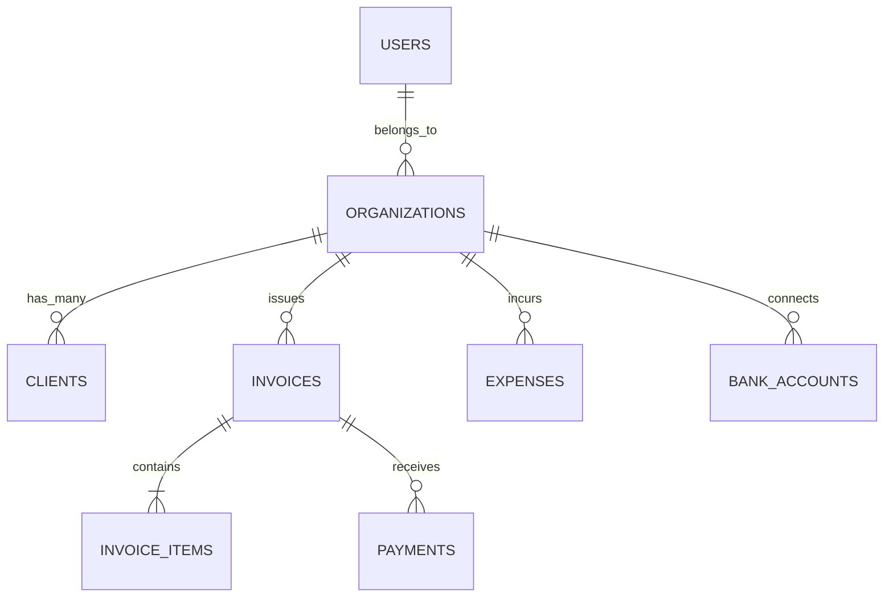

# Product Requirements Document (PRD): SaaS Financial Management Platform (FinFlow)

## 1. App Overview & Objectives
**FinFlow** is an all-in-one financial intelligence and management web application crafted specifically for freelancers, consultants, and small business owners.
The product unifies cash flow monitoring, invoice creation & delivery, Stripe-powered payments, expense & receipt scanning, bank account synchronization, and tax-ready financial reporting into a seamless, high-performance UI.

### Primary Objectives
- **Zero Friction Invoicing**: Generate and send professional invoices with embedded Stripe payment links in under 60 seconds.
- **Automated Bookkeeping**: Auto-categorize bank/card transactions and reconcile client invoice payments in real-time.
- **Accurate Financial Health Insights**: Provide real-time cash flow runway, profit/loss breakdown, and tax liability estimates.

---

## 2. Target Audience
- **Freelancers & Solopreneurs**: Independent designers, developers, writers needing fast invoicing and expense tracking without complex enterprise accounting jargon.
- **Small Business Owners**: Agencies, retail, and service providers (1-20 employees) needing client billing, payment gateway reconciliation, and expense tracking.

---

## 3. Success Metrics & KPIs
- **Invoice Settlement Speed**: >65% of invoices paid within 48 hours via integrated Stripe checkout.
- **User Activation**: >80% of users create their first invoice or connect a bank account within 10 minutes of onboarding.
- **Performance**: <200ms API response time and <1.5s initial page load.

---

## 4. Competitive Analysis & Differentiators
| Feature | Traditional Tools (QuickBooks, FreshBooks) | FinFlow SaaS |
| :--- | :--- | :--- |
| **Pricing & Setup** | Expensive tiers, steep learning curve | Ultra-lean, instant setup in 2 minutes |
| **UI & UX** | Cluttered legacy forms | Modern shadcn/ui + Tailwind design system |
| **Payments** | Slow settlement or high add-on fees | Direct native Stripe integration with instant links |
| **AI Insights** | Basic static charts | Smart expense categorization & automated tax estimation |

---

## 5. Prerequisites and Access
- **Database**: Supabase PostgreSQL database accessible via `@supabase/supabase-js`.
- **Environment Variables**: Defined in `PROJECT_ROOT/.env.local`:
  - `SUPABASE_URL`: Supabase project API URL.
  - `SUPABASE_ANON_KEY`: Supabase public anonymous key.
  - `STRIPE_SECRET_KEY`: Stripe API secret key (fill manually).
  - `STRIPE_PUBLISHABLE_KEY`: Stripe publishable key for client elements (fill manually).
  - `STRIPE_WEBHOOK_SECRET`: Stripe signing secret for webhook verification (fill manually).
  - `PLAID_CLIENT_ID` / `PLAID_SECRET`: Banking API integration credentials (fill manually).
- **Authentication**: Supabase Auth (Email/Password & Magic Link).
- **Component System**: `shadcn/ui` (Button, Dialog, Form, Input, Table, Card, Dropdown, Badge, Tabs).

---

## 6. Core Features & Requirement Breakdown

### `TASK-1`: Prerequisite Verification & Environment Readiness
- Verify `.env.local` contains all required variable names with placeholders.
- Verify Supabase connection and Stripe SDK availability.

### `TASK-2`: Supabase Relational Database Schema & RLS Policies
- Design tables: `organizations`, `users`, `clients`, `invoices`, `invoice_items`, `expenses`, `categories`, `bank_accounts`, `payments`.
- Enforce strict Row Level Security (RLS) ensuring multi-tenant tenant isolation.

### `TASK-3`: User Authentication & Organization Onboarding
- Supabase Auth integration with JWT sessions, email login, and organization workspace profile creation.

### `TASK-4`: Core Dashboard & Financial KPI Widgets
- Bento-grid financial dashboard displaying: Total Revenue, Outstanding Receivables, Monthly Expenses, Net Profit Margin, and Cash Flow Trend chart.

### `TASK-5`: Invoicing Engine & PDF Generator
- Invoice builder with client selector, line items calculation, tax/discount computation, status tracker (`draft`, `sent`, `paid`, `overdue`), and print/PDF download.

### `TASK-6`: Stripe Payment Gateway Integration
- Generate Stripe Checkout sessions for invoices; support card payments, Apple Pay, and Google Pay.

### `TASK-7`: Stripe Webhook & Automated Reconciliation
- Endpoint `POST /api/webhooks/stripe` with signature verification; auto-updates invoice status to `paid` and creates payment ledger record.

### `TASK-8`: Income & Expense Tracking System
- Form to log expenses with vendor, date, category, payment method, tax deductibility flag, and receipt attachment.

### `TASK-9`: Banking & Payment Processor Sync Interface
- Connect bank accounts / credit cards via Plaid or manual bank feed CSV import; auto-match transactions to expenses.

### `TASK-10`: Financial Reports & Tax Insights
- Comprehensive Profit & Loss (P&L) statement, expense breakdown pie chart, monthly revenue growth bar chart, and tax summary export.

---

## 7. Conceptual Data Model

---

## 8. Security & Compliance
- **Data Isolation**: PostgreSQL Row Level Security (RLS) ensures zero cross-organization data leakage.
- **PCI DSS Compliance**: Zero cardholder data stored on servers; all payment processing delegated to Stripe.
- **Secrets Management**: No secret credentials committed to source control; strictly loaded via `.env.local`.
