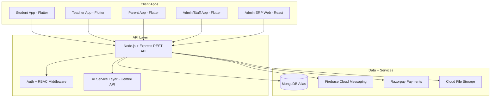

# School/College ERP + Multi-Role App — AI Vibe-Coding Build Guide

> **What this is:** A complete build spec + AI-IDE context pack for a multi-tenant School/College/Institute ERP with role-based apps for Student, Teacher, Parent, and Admin/Staff — in the spirit of the Vedmarg platform you shared. This is an original specification for your own build, not a reproduction of Vedmarg's code, design, or content. I don't have a browser/session tool that can actually log into their live demo, so the feature list below is grounded in Vedmarg's *own public* feature list (app store listings, their website) plus standard practice for this software category — explore their demo yourself and tell me what's different if you want tighter parity.
>
> **Personalized to you:** stack picks below assume your existing Node.js/Express, MongoDB, React, and Flutter experience, plus your Gemini API work — not a generic "best practice" stack you'd have to learn from scratch.

## Table of Contents
1. How to Use This Document
2. Product Vision & User Roles
3. Feature Breakdown by App
4. Recommended Tech Stack
5. System Architecture
6. Data Model (MongoDB)
7. Auth & Role-Based Access Control
8. AI-Enhanced Features
9. Security & Data Privacy (incl. India's DPDP Act)
10. AI IDE Master Context File
11. Phased Build Plan with Sample Prompts
12. Testing & QA Checklist
13. Deployment Notes
14. Vibe-Coding Best Practices
15. Sources Consulted

---

## 1. How to Use This Document

"Vibe coding" = describing what you want in plain language and letting an AI coding agent write and iterate on the code in tight loops, while you review, test, and steer.

**Tools that fit this project well right now (mid/late 2026):**
- **Cursor** — the most capable all-round AI IDE for a real full-stack build like this; strong on multi-file edits/refactors and specifically well-regarded for Flutter/mobile builds.
- **Claude Code** — a terminal-native agent that reads and edits your whole repo, runs commands, and uses a persistent `CLAUDE.md` file in your repo root for standing project context (that's exactly what Section 10 is for). Also available inside VS Code, JetBrains, a desktop app, and the browser if you don't want pure terminal.
- Note: **Windsurf was rebranded to "Devin Desktop"** under Cognition in mid-2026 — same underlying Cascade agent, new name — so if older tutorials mention Windsurf, that's what they're now called.
- Skip app-builders like Lovable/Bolt/Replit Agent for the core build — they're aimed at non-coders doing quick prototypes. As a full-stack dev shipping a real ERP, the control an AI-IDE/agent gives you matters more. They're still handy later for one-off UI mockups.
- This space moves fast — worth a quick check on current tool standing before you start in case something's shifted again.

**How to use the rest of this doc:**
1. Drop Section 10 into your repo as `CLAUDE.md` (Claude Code) or `.cursorrules` (Cursor) — the AI reads it automatically on every task.
2. Work through Section 11 one phase at a time. Paste the sample prompt, let the AI build, then test before moving on.
3. Commit to git after every working phase — vibe coding without frequent commits means you can't cleanly roll back a bad AI edit.
4. Keep a running `DECISIONS.md` for anything you settle that isn't in this doc (e.g. "a 'class' is called a 'batch' for Institute accounts"). Paste its contents into new AI sessions, since context resets between them.

---

## 2. Product Vision & User Roles

Like the Vedmarg reference you shared, this is a **multi-tenant** platform — one codebase, many schools/colleges/institutes, each with fully isolated data. Every organization type shares the same core engine but may need different vocabulary (a "Class & Section" for a school is closer to a "Course & Batch" for an institute) — make terminology a configurable field per organization instead of hardcoding "Class."

**Roles to support** — Vedmarg's own listing goes deeper than a flat admin/teacher/student/parent split, and it's worth matching:

| Role | Who | Core need |
|---|---|---|
| Student | Enrolled learner | See their own academic life |
| Parent/Guardian | Student's family | Monitor, pay, communicate |
| Teacher | Subject/class faculty | Run the classroom |
| Accountant | Fee/finance staff | Manage money, not academics |
| Principal / Vice-Principal / Head Teacher | Academic leadership | Oversight & approvals |
| Admin / Front-Desk / Employee | Operations staff | Day-to-day data entry |
| Director / Manager (owner tier) | Institution owner | Cross-branch visibility, billing |

Build this as a **role hierarchy with permissions**, not four hardcoded roles — useful the day a school asks for a custom "Librarian" role.

---

## 3. Feature Breakdown by App

Reorganized by role/app rather than as one flat list, and trimmed into MVP vs. later phases.

### Admin/Staff ERP (web dashboard + staff mobile app)
- Organization setup: branding, academic year, class/section (or course/batch) structure
- User management: create/import Student, Parent, Teacher, and staff accounts; bulk Excel import/export with field-level filters
- Attendance oversight: daily/monthly reports, defaulter lists, class- and section-wise views
- Academics: exam/marksheet management, report-card generation, date-sheets, admit cards
- Fee management: flexible fee structures (monthly/quarterly/annual), dues tracking, prior-year balance carry-forward, online collection, defaulter reports
- Transport: route/driver/stop management, distance-based fee slabs
- Documents: ID cards (multiple templates), transfer certificates, bonafide certificates
- Communication: notices/circulars targeted by role, class, or whole org (email/SMS/push)
- Admissions: new-enrollment workflow, student promotion between classes, section transfers
- Analytics dashboard: attendance trends, fee collection %, academic performance overview

### Teacher App
- Mark attendance for assigned classes/periods
- Enter marks/grades; view own teaching timetable
- Create homework/assignments with attachments; review & grade submissions
- Upload study material (PDF/DOC/PPT)
- Post notices to their classes; message parents / broadcast to a class
- Apply for leave

### Student App
- Timetable, attendance history, grades/report cards
- Homework: view, submit, track feedback
- Study material library, notices feed
- Fee status + payment history
- Bus route/ETA (if transport module is enabled)

### Parent App
- Everything the student sees, for one or more linked children
- Pay fees online, download receipts
- Message teachers, receive notices via push/SMS/email
- Apply for leave/absence on behalf of the child

**MVP suggestion:** don't build all of this in one pass. A realistic first shippable slice is multi-tenant auth → attendance → notices → basic gradebook → fee status (view-only). Add payments, transport, ID cards, and certificate generation once the core loop works and you've tested it with a real or pilot school.

---

## 4. Recommended Tech Stack

Matched to what you already know, so the AI agent generates code you can actually review line-by-line — that matters more than a "trendier" stack.

| Layer | Choice | Why |
|---|---|---|
| Backend | Node.js + Express + TypeScript | Your existing stack; heavily represented in AI training data, so agents produce reliable code here |
| Database | MongoDB (Mongoose) | Your existing stack; flexible schema suits an ERP where School vs. College records differ |
| Student/Teacher/Parent/Admin apps | Flutter | One codebase covers Android + iOS (matches the brief you shared) and you already know it — currently well-regarded specifically for Flutter/mobile builds in AI-IDE workflows |
| Admin Web Dashboard | React + Vite + Ant Design (or shadcn/ui) | Your existing stack; Ant Design's pre-built tables/forms suit this kind of data-heavy admin screen and speed up vibe-coding a lot |
| Auth | JWT + bcrypt, optional OTP via an SMS gateway (e.g. MSG91/Twilio) | Matches the username+password *and* OTP-style login Vedmarg itself offers |
| Push notifications | Firebase Cloud Messaging | Integrates cleanly with Flutter via `firebase_messaging` |
| Payments | Razorpay | Standard for Indian fee collection |
| AI features | Gemini API | You already have integration experience here — see Section 8 |
| Hosting | Backend: Render/Railway; DB: MongoDB Atlas; Admin web: Vercel; Mobile builds: a Flutter-friendly CI (e.g. Codemagic) | Low-ops, fits a solo/small-team build |

One structural decision to make early: **one Flutter codebase with role-based app shells, or four separate Flutter apps sharing a common package.** Vedmarg ships separate apps per role (separate store listings). Four apps means smaller downloads and cleaner branding per audience; one app with a role-aware home screen means far less duplicated code to maintain solo. Given you're building and maintaining this yourself, one codebase with per-role **build flavors** is the more maintainable middle ground — separate store listings without four codebases.

---

## 5. System Architecture



Every client hits the same Express API; role and organization checks happen server-side in middleware, never trusted from the client.

---

## 6. Data Model (MongoDB Collections)

Starting schema — expect to extend it, but get the multi-tenant field right from collection #1:

```
organizations       { _id, name, type: school|college|institute, terminology: {classLabel, sectionLabel}, address, subscriptionPlan }
users                { _id, organizationId, name, username, passwordHash, role, status, otpEnabled }
studentProfiles      { _id, userId, organizationId, classId, section, rollNumber, admissionNumber, dob, parentIds[] }
teacherProfiles      { _id, userId, organizationId, subjectsTaught[], classesAssigned[], designation }
parentProfiles       { _id, userId, organizationId, childrenIds[] }
classSections        { _id, organizationId, className, section, classTeacherId, academicYear }
subjects             { _id, organizationId, classId, name, teacherId }
attendanceRecords    { _id, organizationId, studentId, classId, date, status, markedBy }
examResults          { _id, organizationId, studentId, examName, term, subjectMarks[] }
homework             { _id, organizationId, classId, subjectId, teacherId, title, attachments[], dueDate }
homeworkSubmissions  { _id, homeworkId, studentId, submittedAt, attachmentUrl, status, feedback }
notices              { _id, organizationId, title, body, targetAudience, createdBy }
feeStructures        { _id, organizationId, classId, components[], frequency, dueDate, academicYear }
feeTransactions      { _id, organizationId, studentId, feeStructureId, amountPaid, paymentDate, receiptNumber, status }
timetableEntries     { _id, organizationId, classId, dayOfWeek, period, subjectId, teacherId }
transportRoutes      { _id, organizationId, routeName, stops[], driverInfo, feeSlab, studentIds[] }
consentRecords       { _id, organizationId, studentId, guardianUserId, consentType, givenAt, verificationMethod }
```

`consentRecords` exists specifically for the guardian-consent requirement in Section 9 — build it in now rather than retrofitting it later.

**Golden rule:** every query touching these collections must filter by `organizationId`. This is the single most important line to re-check in every AI-generated function — a missing filter here is a cross-school data leak.

---

## 7. Auth & Role-Based Access Control

- Login by username/password (as in the demo you were given), plus an OTP option for parents — matches what Vedmarg itself offers and is the friendlier flow for less tech-savvy parents.
- JWT stores `{ userId, organizationId, role }`; every protected route's middleware checks the role against an allow-list for that route **and** re-derives `organizationId` from the token — never from a request parameter the client could tamper with.
- Don't ship demo-style weak passwords (like `12345678`) to production — enforce a minimum password policy for staff, and force a reset on first login for admin-created accounts.
- Students/Parents get read-only access scoped to their own/child's records; Teachers scoped to their assigned classes; Admin-tier roles scoped to their organization. Nothing crosses an `organizationId` boundary, for any role, ever.

---

## 8. AI-Enhanced Features

Since you've already got Gemini API experience, this is a natural differentiator against a template ERP:

- **Auto-drafted report-card remarks** — feed a student's grades + attendance into Gemini to draft a natural-language teacher remark, which the teacher edits and approves (never auto-sent unreviewed).
- **Parent FAQ chatbot** — answer "when is the next fee due" or "what was today's homework" by querying that student's own records via function-calling, scoped strictly to the linked parent's own child.
- **Notice translation** — auto-translate circulars into regional languages (Hindi, Kannada, etc.) for parents who prefer them — genuinely useful given how multilingual most Indian school parent bases are.
- **At-risk flagging** — a simple rule/AI-assisted pass over attendance and grade trends to flag students worth a teacher's attention, surfaced only to staff.

Treat all of these as assistive drafts a human approves, not autonomous actions — especially anything that reaches a parent directly.

---

## 9. Security & Data Privacy

This app processes children's personal data, which puts it squarely inside India's **Digital Personal Data Protection (DPDP) Act, 2023**, with its **Rules notified in November 2025**. Worth building for properly now: compliance is phasing in over 2026–2027, with a consent-manager framework arriving around November 2026 and the law's full enforcement powers switching on the following May.

Anyone under 18 counts as a child under the Act, so the ERP needs:
- **Verifiable guardian consent** captured before a student's personal data is processed — what the `consentRecords` collection above is for.
- No behavioural tracking or targeted advertising aimed at student users, ever.
- Data minimization — collect only what a school actually needs, not everything the schema *could* hold.
- A breach-notification path — affected users and the Data Protection Board would need notifying within a defined window if something goes wrong.

I'm not a lawyer and this isn't legal advice — treat the above as engineering-relevant context, and get an actual compliance/legal review before selling this to real schools.

General security hygiene the AI agent should follow throughout:
- Hash passwords with bcrypt/argon2; never log or store plaintext credentials or payment details
- Enforce RBAC and `organizationId` scoping server-side, never by hiding a button in the UI
- Rate-limit and lock out repeated failed logins
- TLS everywhere; encrypt sensitive fields at rest
- Audit-log sensitive actions (grade edits, fee waivers, data exports, consent changes)

---

## 10. AI IDE Master Context File

Save this as `CLAUDE.md` (Claude Code reads it automatically) or `.cursorrules` (Cursor) in your repo root. Edit the bracketed parts, keep the rest as-is.

```markdown
# Project: [Your ERP Name] — AI Coding Context

## What this is
A multi-tenant School/College/Institute ERP: role-based Flutter apps
(Student, Teacher, Parent, Admin/Staff) + a React admin web dashboard,
on a shared Node.js/Express/MongoDB backend.

## Stack (locked — ask before changing)
Backend: Node.js + Express + TypeScript
DB: MongoDB + Mongoose
Mobile: Flutter, one codebase, per-role build flavors
Admin web: React + Vite + Ant Design
Auth: JWT + bcrypt, optional OTP for parents
Notifications: Firebase Cloud Messaging
Payments: Razorpay
AI: Gemini API, assistive/draft-only

## Conventions
- All routes versioned under /api/v1/
- Every collection has organizationId; every query filters by it
- Role checks live in Express middleware, never only in the frontend
- async/await only, no callback style
- New endpoint = new Jest test, no exceptions
- Commit after every working feature; message describes the feature, not the file

## Never do this
- Never drop the organizationId filter from a query
- Never store plaintext passwords or raw payment details
- Never let one organization's data leak into another's response, even in an error message
- Never touch auth or payments code without flagging it for manual review
- Never delete a migration or seed file without asking first

## Local dev
npm run dev    -> starts backend
npm run seed   -> creates one demo org + 4 demo users (admin/teacher/parent/student)
```

---

## 11. Phased Build Plan

Work top to bottom. Test and commit after each phase before starting the next.

| Phase | Scope |
|---|---|
| 0 | Repo scaffolding, env config, DB connection, CI skeleton |
| 1 | Multi-tenant model + auth (Organization, User, JWT, role-guard middleware, seed script) |
| 2 | Admin core (class/section setup, user management, bulk import) |
| 3 | Attendance (teacher marks it, student/parent view it, admin reports on it) |
| 4 | Academics (timetable, homework, gradebook, report cards) |
| 5 | Communication (notices, optional teacher-parent messaging) |
| 6 | Fees (structures, Razorpay integration, receipts, dues tracking) |
| 7 | Mobile polish (push notifications, app icons, Flutter build flavors) |
| 8 | Testing & QA pass across all four roles |
| 9 | Deployment (backend hosting, Flutter store builds, admin web deploy) |

**Sample prompt — Phase 1:**
> "Using the stack and rules in CLAUDE.md, build an Organization model (name, type: school/college/institute, address) and a User model (name, username, passwordHash, role, organizationId, status) in MongoDB via Mongoose. Add JWT login and role-guard middleware that checks both role and organizationId server-side. Add a seed script creating one demo organization with four demo users — admin, teacher, parent, student — the same shape as a sales demo login set. Write Jest tests for valid/invalid login and for the role guard rejecting cross-role access."

**Sample prompt — Phase 3:**
> "Add attendance: teachers mark present/absent/late per student for their assigned class and date. Students/parents can only see their own/child's history. Admins see all classes plus a defaulter summary. Enforce organizationId scoping and role checks per CLAUDE.md. Add a compound index on {organizationId, studentId, date}."

---

## 12. Testing & QA Checklist

- [ ] Each role's core flows work end-to-end (use the seeded demo accounts)
- [ ] A student/parent cannot reach another student's data by guessing an ID (IDOR check)
- [ ] A user from Organization A cannot see Organization B's data under any route
- [ ] Fee payment flow reconciles correctly on a Razorpay webhook failure/retry
- [ ] Consent is recorded before a new student's data is first processed
- [ ] Push notifications arrive on both Android and iOS test devices

---

## 13. Deployment Notes

- Flutter: build role-based flavors, submit each to Play Store/App Store separately — matches the Android+iOS requirement and Vedmarg's own separate-apps approach
- Both stores require a privacy policy URL; since this app handles children's data, budget extra time for Google Play's Families policy and Apple's data-collection disclosure requirements during review
- Containerize the backend early even if you deploy simply at first — makes moving between hosts later painless
- Keep staging and production MongoDB clusters fully separate — never test against a real school's data

---

## 14. Vibe-Coding Best Practices for This Project

- Small, testable increments — one phase, one feature, then test, then commit
- Read every line the AI writes for auth, payments, and the `organizationId` filters — spot-check everywhere else
- Re-paste the relevant section of this doc (or your `DECISIONS.md`) at the start of a new AI session — context resets between sessions
- Let the AI write tests, not just features — "add a feature" and "add a test for it" are two separate asks
- When the AI's output looks right but you can't fully explain why it works, stop and have it walk you through it before moving on

---

## 15. Sources Consulted
- Vedmarg's own site and published feature list — vedmarg.com
- Vedmarg Admin app listings — Google Play / App Store
- DPDP Rules, 2025 — public summaries of the November 2025 notification and phased rollout
- 2026 AI coding-tool comparisons covering Cursor, Claude Code, and Windsurf/Devin Desktop
